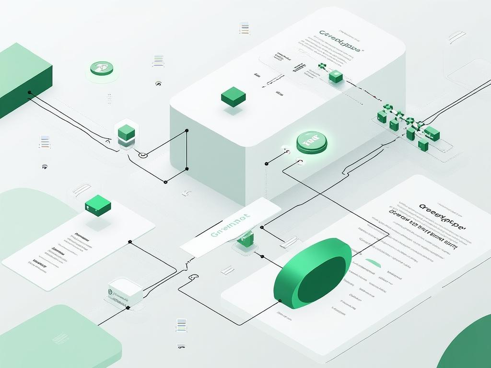

# Seedify — The Living Laboratory

Your AI-powered second brain. Capture ideas through chat, voice, or notes — enriched with web research, your personal memory, semantic connections, and a living wiki. Delivers personalized daily email digests connecting new research to your existing knowledge.

> **Vision:** The Seedify architecture is the blueprint for **connected knowledge** systems — connecting all structured and unstructured operational data into agentic context graphs for end-to-end processes (idea-to-outcome, research-to-brief, spec-to-build, capture-to-archive). Inspired by Karpathy's LLM Wikis, Foundation Capital's decision lineage, and OriginTrail DKG.

## Architecture

```
┌─────────────────────────────────────────────────────────────────────────┐
│                        Next.js PWA (Vercel)                             │
│  Chat · Garden · Sources · Wiki · Onboarding · Voice Memos · Push     │
│  ┌──────────┐  ┌───────────┐  ┌──────────┐  ┌──────────┐  ┌────────┐  │
│  │ Chat v2  │  │  Garden   │  │ Sources  │  │ Wiki     │  │ API    │  │
│  │ + Tools  │  │ + Intel   │  │ + Bridge │  │ + Maps   │  │ Routes │  │
│  │ + Source │  │ + Decay   │  │          │  │ + Images │  │ (30+)  │  │
│  │ Surfacing│  │ + Revisit │  │          │  │ TOC      │  │        │  │
│  │ + History│  │ + Viz Tool│  │          │  │ Compile  │  │        │  │
│  └──────────┘  └───────────┘  └──────────┘  └──────────┘  └────────┘  │
│  ┌──────────────────────────────────────────────────────────────────┐  │
│  │  Service Worker (sw.js) ← Web Push ← VAPID                      │  │
│  │  Activity Summary ("What's New") — shown on every login          │  │
│  └──────────────────────────────────────────────────────────────────┘  │
└─────────────────────────┬───────────────────────────────────────────────┘
                          │ Authorization: Bearer JWT
                          ▼
┌─────────────────────────────────────────────────────────────────────────┐
│                   FastAPI Backend (Docker, port 8001)                   │
│  JWT Auth · Tool Calling · Session Mgmt · Activity Feed · Wiki          │
│  ┌──────────────┐  ┌──────────────┐  ┌────────────────────────┐       │
│  │  Chat v1/v2  │  │  Enricher v2 │  │  Tool Executor (15)    │       │
│  │  (streaming) │  │  URL detect  │  │  search_seeds          │       │
│  │  + source    │  │  + Exa fetch │  │  search_sources        │       │
│  │    surfacing │  │  + domain/   │  │  create_seed           │       │
│  │  + sessions  │  │  energy infer│  │  read_source            │       │
│  └──────────────┘  └──────┬───────┘  │  web_search            │       │
│                            │        │  get_daily_briefing    │       │
│  ┌──────────────┐         │        │  get_garden_intel      │       │
│  │  Wiki Engine │◄────────┘        │  get_knowledge_digest  │       │
│  │  Auto-compile│                 │  get_activity_feed     │       │
│  │  + Re-synth  │  ┌──────────┐  │  rate_seed             │       │
│  └──────┬───────┘  │ Briefings│  │  get_seed_detail       │       │
│         │          │ + Email  │  │  search_seeds_filtered │       │
│         ▼          │ (Resend) │  │  visualize_garden      │       │
│  ┌──────────────┐  └──────────┘  └────────────────────────┘       │
│  │  Redis Queue │                                                 │
│  │  (pub/sub)   │                                                 │
│  └──────┬───────┘                                                 │
│         │                                                          │
│         ▼                                                          │
│  ┌──────────────────┐  ┌──────────────┐  ┌──────────────────┐     │
│  │ Enrichment Worker│  │ Redis Cache  │  │  Web Push (VAPID)│     │
│  │ (separate proc)  │  │ (seed lookup)│  │  pywebpush        │     │
│  └──────────────────┘  └──────────────┘  └──────────────────┘     │
└──────┬───────────────┬──────────────────┬──────────────────────────┘
       │               │                  │
       ▼               ▼                  ▼
┌──────────────┐ ┌──────────────┐ ┌──────────────────┐
│  PostgreSQL  │ │   Weaviate   │ │      Redis       │
│  (port 5432) │ │  (port 8080) │ │    (port 6379)   │
│              │ │              │ │                  │
│  users       │ │  IdeaSeed    │ │  enrichment queue│
│  seeds*      │ │  Link        │ │  activity feed   │
│  ratings     │ │  WikiArticle │ │  cache layer     │
│  sessions    │ │  230+ items  │ │  task status     │
│  push_subs   │ │  BM25 + vec  │ │  push notifs     │
└──────────────┘ └──────────────┘ └──────────────────┘

* seeds table includes: last_visited, visit_count (for decay scoring)
```




## Core Concepts

### Sources → Seeds → Wiki (The Full Pipeline)

The pipeline flows in one direction, with each stage adding value:

```
Sources (collect) ──→ Seeds (develop) ──→ Wiki (synthesize)
       │                    │                    │
       │  Enriched with     │  Connected, rated, │  Wikipedia-style
       │  title, summary,   │  decay-scored,     │  articles with
       │  entities, tags    │  visit-tracked     │  citations + maps
       │                    │                    │
       └──── Auto-bridge ───┴──── Auto-compile ──┘
       (Sources → Seeds      (Seeds/Links → Wiki)
        when no related
        seeds exist)
```

### Seeds vs Sources

Two distinct entities with a clear bridge:

| | **Sources (Links)** | **Seeds (Garden)** |
|---|---|---|
| **What** | External URLs, references, articles | Personal ideas, insights, thoughts |
| **Flow** | Inbound (collect & browse) | Outbound (develop & connect) |
| **Value** | "Is this reference useful?" | "Is this idea worth pursuing?" |
| **Lifecycle** | Enriched once (metadata) | Full pipeline (enrich, connect, rate, decay) |
| **Bridge** | → "Create Seed from Source" | ← Shows source origins |

### Decay Scoring

Seeds lose relevance over time. The Garden Intelligence uses a decay formula:

```
relevance = e^(-0.05 × age_days) × (1 + visit_count × 0.5)
```

- **14-day half-life** — seeds naturally decay
- **Visits boost** — viewed seeds stay relevant longer
- **"Needs revisiting"** — seeds not viewed in 30+ days
- **"Stale"** — low relevance + unrated + 7+ days old

## Features

### 💬 Chat (15 tools)
The chat is the primary interface to the entire knowledge base:

| Tool | Description |
|------|------------|
| `search_seeds` | Semantic search over Garden seeds |
| `search_sources` | Search saved source links |
| `create_seed` | Create a new idea seed |
| `create_seed_from_source` | Bridge: create seed from a source |
| `read_source` | Fetch and read full source content |
| `web_search` | Search web (auto-saves to Sources) |
| `get_daily_briefing` | Actionable morning digest (includes missed connections) |
| `get_garden_intelligence` | Trending, stale, decay, revisit suggestions |
| `get_seed_detail` | Full seed with enrichment + auto visit tracking |
| `get_knowledge_digest` | Recent seeds + sources + connections |
| `get_activity_feed` | What the system has been doing |
| `rate_seed` | Rate seeds 1-5 stars |
| `list_recent_seeds` | Browse recent seeds |
| `search_seeds_filtered` | Search by domain/tag/energy |
| `visualize_garden` | Interactive D3 force graph of all seeds by domain + tag |

**Source Surfacing:** When relevant, the chat automatically surfaces saved sources that match the conversation topic. The LLM sees: *"📎 Relevant sources: Forward-Deployed Engineer (sundeepteki.org)"* and can reference them.

**Persistent Chat History:** Conversations are saved as `ChatSession` records in Postgres. The frontend stores session IDs in `localStorage` and restores full history on revisit.

**Missed Connections:** The daily briefing finds unlinked seed pairs with shared tags:
```
🔍 Connections you missed:
  • "AI Agents" ↔ "MCP Protocol" (shared: architecture)
```

### 📖 Wiki (Wikipedia/GrokPedia-style)
Auto-generated articles that synthesize your sources and seeds into encyclopedic entries:

- **Structure:** Bold lead definition → Table of Contents → Overview → Key Insights → Applications → Connections → Critical Analysis → See Also → Sources
- **Citations:** Inline `[1]`, `[2]` references linking back to original sources
- **Analysis sections:** 💭 AI-generated observations and synthesis markers
- **"What to explore next"** — actionable suggestions at article end
- **BFL hero images** — generated concept art for each article
- **D3 concept maps** — force-directed connection visualizations
- **Auto-compile:** Groups enriched content by domain/tag, runs LLM synthesis
- **Seed-cluster compilation:** Compiles uncovered seeds even without link matches
- **Manual compile button:** UI button triggers `/api/v1/wiki/auto-compile` via user Bearer auth
- **Quality:** 1,300–1,800 word articles (vs. previous 200–300 word dumps)
- **Model:** deepseek/deepseek-v3.2 via OpenRouter

### 🔔 Push Notifications (Web Push)
True push notifications via VAPID + Service Worker:
- Works even when PWA is closed/backgrounded
- Cron jobs trigger pushes (daily briefing, idea spark, etc.)
- Subscribe via Settings → Push Notifications toggle
- Auto-removes expired subscriptions (404/410 only)
- Idempotent service worker registration with error detail

### 🌱 Garden
- Semantic search via Weaviate (BM25 + vector)
- Knowledge graph with seed connections (click to open detail)
- **Garden Intelligence API:** trending seeds, stale (decay), needs revisiting, health score
- **Interactive visualization:** `visualize_garden` tool renders inline D3 force graph via chat, grouped by domain + tag proximity
- Star ratings for seed quality
- Visit tracking: `last_visited`, `visit_count`
- URL detection in seeds: Exa full-page fetch for web-sourced thoughts; LLM-inferred `domain` and `energy` fields

### 📎 Sources
- Auto-enriched on add (title, summary, domain, favicon, OG image)
- Auto-connected to related seeds (tag/domain/title scoring)
- Auto-populated from web searches (both chat and enrichment pipeline)
- "Create Seed from Source" button (Sources → Garden bridge)
- Shows spawned seeds for each source
- Auto-bridge: Sources → Seeds created automatically when no related seeds exist

### 📬 Email Digests (Resend)
Personalized daily emails grounded in your Garden and Wiki:

| Digest | Time | Content |
|--------|------|---------|
| Enterprise Digest | 09:30 CET | Daily briefing — seeds to review, missed connections, sources |
| Academic + Research Digest | 07:00 CET | Top arXiv papers for your themes → connected to your Garden seeds and Wiki articles → actionable move + solution design seed. arXiv PDFs attached. |
| Weekly Content Eval | Sunday 18:00 CET | Rated seeds review, enrichment quality summary |

Requires `RESEND_API_KEY` in `.env`. Free tier (3,000 emails/month) covers all jobs.

### 📊 Activity Summary ("What's New")
Shown on every PWA login (empty state + with messages):
- Total seeds, sources, and articles at a glance
- Recent activity items with icons
- Dismissable per session (4-hour cooldown)
- Live stats bar

### ⚡ Architecture

**Task Service Separation:**
- Enrichment runs as a standalone worker (`openclaw-worker` container)
- Harvest pushes jobs to Redis queue (non-blocking)
- Worker processes enrichment independently
- Fallback to inline if Redis is down

**Redis Layer:**
- **Queue:** Sorted set for enrichment job priority
- **Cache:** Seed/link lookups (5min TTL) for Garden page performance
- **Activity Feed:** Sorted set of system events
- **Task Status:** Hash of enrichment job states
- **Push Notifications:** Queued for polling fallback

**Activity Feed:**
Tracks system events: seed creation, source discovery, enrichment completion, ratings. Available via API and chat tool.

### 🧠 Multi-Layer Memory (MLMA)
Based on [arxiv.org/abs/2603.29194](https://arxiv.org/abs/2603.29194):
- **Working Memory** — bounded dialogue window
- **Episodic Memory** — recursive session summaries with decay
- **Semantic Memory** — entity-event graphs with stability scores

### 🎙️ Voice Memos
Record → Whisper transcription → message → optional seed creation

### 📅 Google Calendar Integration
OAuth connect → smart cron timing based on calendar gaps

## Running

### Backend (Docker Compose)
```bash
cd openclaw-api
docker compose up -d --build
```
Services:
- **FastAPI** (port 8001) — main API
- **Enrichment Worker** — background enrichment via Redis queue
- **PostgreSQL** (port 5432) — users, seeds, ratings, sessions
- **Weaviate** (port 8080) — vector + BM25 search
- **Redis** (port 6379) — queue, cache, activity feed, push

### Frontend (Vercel)
```bash
npm install
npm run dev
```

### Environment Variables
```bash
# Backend (.env)
OPENROUTER_API_KEY=sk-or-...
WEAVIATE_URL=http://weaviate:8080
REDIS_URL=redis://redis:6379/0
VAPID_PRIVATE_KEY_PATH=/app/.vapid_private.pem
RESEND_API_KEY=re_...              # Email digests (optional — disables email if unset)
EMAIL_FROM=Seedify <digest@...>    # Verified Resend sender domain

# Frontend (.env.local)
NEXT_PUBLIC_VAPID_KEY=BMvL3eG7...
NEXT_PUBLIC_API_URL=https://api.greenplot.ink
```

## Project Structure
```
├── src/                        # Next.js frontend
│   ├── app/
│   │   ├── chat/               # Chat page with source surfacing + activity summary
│   │   ├── garden/             # Garden grid/list + intelligence + graph
│   │   ├── links/              # Sources page + create seed bridge
│   │   ├── settings/           # Push notifications, calendar, profile
│   │   ├── wiki/               # Wiki browser + article view + concept maps
│   │   ├── onboarding/         # 5-step onboarding flow
│   │   └── api/
│   │       ├── chat/           # AI streaming proxy (v1/v2)
│   │       ├── seeds/          # Seed CRUD + search + graph + garden intel
│   │       ├── links/          # Source CRUD + enrichment
│   │       ├── wiki/           # Wiki CRUD + auto-compile + image gen + concept maps
│   │       ├── push/           # Web Push subscribe/send/notifications
│   │       ├── profile/        # Profile update proxy (city, nickname)
│   │       └── activity/       # Activity summary for login screen
│   ├── components/
│   │   ├── ai-elements/        # AI SDK UI (Conversation, Message, Tool, Sources)
│   │   ├── activity-summary.tsx# "What's New" card for login
│   │   ├── links/              # Link detail sheet + seed bridge
│   │   ├── seeds/              # Seed detail + knowledge graph (D3)
│   │   └── ui/                 # shadcn/ui components
│   └── hooks/
│       ├── use-voice-recorder.ts
│       └── use-push-notifications.ts  # VAPID subscribe + poll (improved error handling)
├── openclaw-api/               # FastAPI backend
│   ├── app/
│   │   ├── main.py             # API routes (50+), Web Push, migrations, cron jobs
│   │   ├── weaviate_client.py  # Weaviate client (IdeaSeed + Link + WikiArticle)
│   │   ├── tool_executor.py    # 15 LLM tool handlers + decay scoring + visualize_garden
│   │   ├── tools.py            # Tool definitions (OpenAI format)
│   │   ├── enricher.py         # URL detection + Exa full-page fetch + LLM seed gen
│   │   ├── enricher_v2.py      # Seed enrichment pipeline (URL-aware)
│   │   ├── briefings.py        # Daily/academic digest builders + garden/wiki context
│   │   ├── email_sender.py     # Resend API email dispatch + arXiv PDF attachments
│   │   ├── entity_extractor.py # LLM topic/entity extraction
│   │   ├── backlinker.py       # Auto-link related seeds
│   │   ├── wiki.py             # Wiki engine (auto-compile, synthesis, images, maps)
│   │   ├── task_broker.py      # Redis queue (publish/consume)
│   │   ├── task_worker.py      # Standalone enrichment worker
│   │   ├── cache.py            # Redis cache layer
│   │   ├── activity.py         # Activity feed (Redis sorted set)
│   │   ├── links.py            # Source link CRUD + enrichment
│   │   ├── database.py         # SQLAlchemy + PostgreSQL
│   │   ├── models.py           # Seed, User, ChatSession, etc.
│   │   ├── garden_health.py    # Decay scoring + health monitoring
│   │   └── agent/              # Chat agent architecture
│   ├── .vapid_private.pem      # VAPID private key for Web Push
│   └── docker-compose.yml      # Full stack orchestration
├── skills/idea-garden-rag/     # Notion pipeline
│   ├── enrich_and_plant.py     # Web search + Nemotron synthesis
│   ├── garden_orchestrator.py  # Pipeline entry point
│   ├── sync_and_fetch_weaviate.py  # Notion ↔ Weaviate sync
│   └── multi_layer_memory.py   # MLMA implementation
├── docs/                       # Specifications & docs
│   ├── wiki-prompts.md         # Wiki synthesis prompt engineering
│   └── wiki-structure-spec.md  # Article structure specification
└── memory/                     # Session logs
```

## Cron Jobs
| Job | Schedule | Push | Email | Description |
|---|---|---|---|---|
| Weaviate Watchdog | Every 30 min | — | — | Health check, alerts on failure |
| Auto-seed Harvest | Every 30 min | — | — | Scan chat sessions → Redis queue → enrichment |
| Morning Idea Spark | 08:30 CET | ✓ | — | Creative prompt from latest seed |
| Daily Briefing | 09:30 CET | ✓ | ✓ | Weather + seeds to review + sources + missed connections |
| Academic + Research Digest | 07:00 CET | ✓ | ✓ + PDFs | arXiv papers × your Garden + Wiki → actionable move + solution design |
| Daily Reflection | 16:00 CET | ✓ | — | Reflection prompt |
| Weekly Garden Digest | Sunday 10:00 CET | ✓ | — | Research top themes, Exa search, synthesize digest article |
| Weekly Content Eval | Sunday 18:00 CET | ✓ | ✓ | Review rated seeds, enrichment quality |
| FDE Interview Prep | 1st & 15th 10:00 CET | ✓ | — | Personalized interview prep challenges |
| Wiki Auto-Compile | Every 6h | — | — | Compile new seeds/links into wiki articles |
| Auto-seed Enrichment | Every 5 min | — | — | Enrich new seeds with tags, domain, energy, connections |
| Pending Link Enrichment | 07:00 & 19:00 CET | — | — | Enrich unprocessed source links |

## Tech Stack
- **Frontend:** Next.js 15, React 19, TypeScript, Tailwind CSS 4, shadcn/ui, AI SDK v5, D3.js
- **Backend:** FastAPI, Python 3.12, SQLAlchemy, JWT auth, pywebpush, APScheduler
- **Database:** PostgreSQL 15, Weaviate 1.36 (BM25 + vector), Redis 7
- **AI:** OpenRouter (deepseek/deepseek-v3.2), OpenAI Whisper, BFL FLUX, Exa Search
- **Email:** Resend API (transactional email + arXiv PDF attachments)
- **Memory:** Multi-Layer Memory Architecture + MemFactory pipeline
- **Push:** Web Push via VAPID (pywebpush + Service Worker)
- **Infra:** Docker Compose, Vercel Pro, OpenClaw (agent orchestration)

## Design System
- **Colors:** Warm off-white `#fafaf8` background, green `#16a34a` primary, gold `#d97706` secondary, white cards with subtle borders
- **Font:** Plus Jakarta Sans (headings) + Be Vietnam Pro (body)
- **Corners:** rounded-2xl (1rem) for cards, rounded-full (9999px) for pills/badges
- **Shadows:** soft green glow on focus, subtle elevation on hover
- **Dark mode:** opt-in toggle via `.dark` class

## Status
🟢 **Working:** Chat (15 tools + persistent history), Garden + Intelligence + Decay + Visualization, Sources + Bridge, Wiki (auto-compile, BFL images, D3 maps, UI compile button), Web Push notifications, Email digests (Resend), Academic + Research Digest with arXiv PDFs, Enrichment worker (URL detection + Exa fetch + domain/energy inference), Redis queue/cache, Activity feed, Activity Summary on login, Knowledge graph, Visit tracking, Image generation, Calendar integration, Profile API, D3 concept maps, Solution design export
🟡 **Partial:** Email digests (requires RESEND_API_KEY on server), Push notifications (requires home-screen install on iOS Safari)
🔴 **Pending:** App Store (Capacitor), Figma MCP, Wiki Index page, Wiki Lint, Incremental per-source updates, "New sources" UI badge

