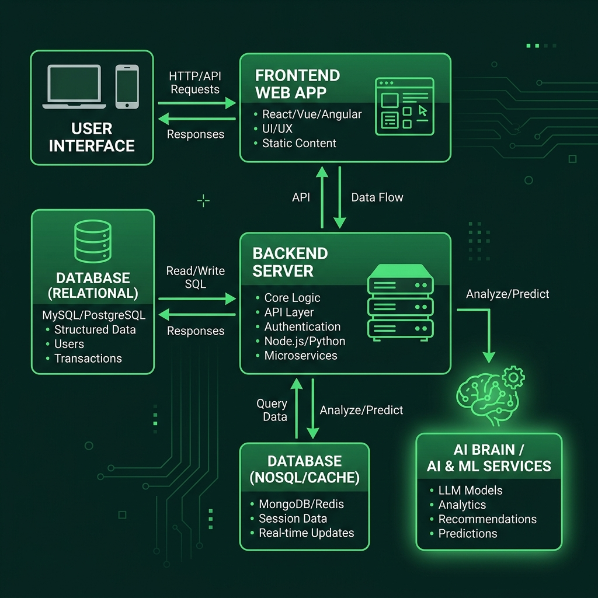

# Greenplot — The Living Laboratory

Your AI-powered second brain. Capture ideas through chat, voice, or notes — enriched with web research, your personal memory, and semantic connections.

## Architecture



```
┌─────────────────────────────────────────────────────────────────────┐
│                        Next.js PWA (Vercel)                         │
│  Chat · Garden · Onboarding · Voice Memos · Push Notifications     │
│  ┌──────────┐  ┌───────────┐  ┌──────────┐  ┌──────────────────┐  │
│  │ Chat v2  │  │  Garden   │  │  Login/  │  │  API Routes (20) │  │
│  │ + Enrich │  │  Search   │  │  Onboard │  │  BACKEND_URL env │  │
│  └──────────┘  └───────────┘  └──────────┘  └──────────────────┘  │
│  Middleware: JWT check on protected routes · Error boundaries      │
└─────────────────────────┬───────────────────────────────────────────┘
                          │ Authorization: Bearer JWT
                          ▼
┌─────────────────────────────────────────────────────────────────────┐
│                   FastAPI Backend (Docker, port 8001)               │
│  JWT Auth · Tool Calling · Enrichment Pipeline · Session Mgmt      │
│  ┌──────────────┐  ┌──────────────┐  ┌────────────────────────┐   │
│  │  Chat v2     │  │  Enricher v2 │  │  Tool Executor         │   │
│  │  (streaming) │  │  (pipeline)  │  │  search_seeds          │   │
│  │              │  │  chunk→embed │  │  list_recent_seeds     │   │
│  │  Web Search  │  │  →entity→    │  │  get_daily_briefing    │   │
│  │  (Exa)       │  │  backlink    │  │  web_search            │   │
│  └──────────────┘  └──────────────┘  │  search_seeds_filtered │   │
│                                      └────────────────────────┘   │
│  ┌──────────────┐  ┌──────────────┐  ┌────────────────────────┐   │
│  │  Voice Ingest│  │  Image Gen   │  │  Push Subscriptions    │   │
│  │  (Whisper)   │  │  (BFL FLUX)  │  │  (dedicated endpoint)  │   │
│  └──────────────┘  └──────────────┘  └────────────────────────┘   │
└──────┬───────────────┬──────────────────┬──────────────────────────┘
       │               │                  │
       ▼               ▼                  ▼
┌──────────────┐ ┌──────────────┐ ┌──────────────────┐
│  PostgreSQL  │ │   Weaviate   │ │      Redis       │
│  (port 5432) │ │  (port 8080) │ │    (port 6379)   │
│              │ │              │ │                  │
│  users       │ │  IdeaSeed    │ │  background jobs │
│  ratings     │ │  228 seeds   │ │  caching         │
│  usage       │ │  BM25 + vec  │ │                  │
│  calendar    │ │  tenant iso  │ │                  │
└──────────────┘ └──────────────┘ └──────────────────┘

External APIs:
  OpenRouter (AI models) · BFL (image gen) · Exa (web search)
  Google Calendar (OAuth) · wttr.in (weather)
```

## Core Features

### 🧠 Multi-Layer Memory (MLMA)
Based on [arxiv.org/abs/2603.29194](https://arxiv.org/abs/2603.29194) — three memory layers with adaptive retrieval:

- **Working Memory** — bounded window of recent dialogue (2000 tokens)
- **Episodic Memory** — recursive session summaries with decay (α=0.7)
- **Semantic Memory** — stable entity-event graphs with stability scores

Adaptive gating: `γ_i = softmax(β * sim(query, layer_i))` — dynamically prioritizes the most relevant layer.

### 🌱 Garden Enrichment
Every message is enriched from two sources in parallel:
1. **Garden search** — backend vector search on Weaviate (tenant-filtered)
2. **Memory retrieval** — adaptive layer weighting (conversation history)

Intelligent intent classification skips enrichment for greetings/short messages. Relevance gate ensures only useful seeds are injected.

### 🎙️ Voice Memos
Tap the mic → record → auto-transcribe via backend Whisper → send as message → optionally plant as seed.

### 📊 MemFactory Pipeline
Inspired by [Valsure/MemFactory](https://github.com/Valsure/MemFactory) — modular memory processing:
- **Extractor** — LLM extracts structured memory items (key, value, type, tags)
- **Updater** — decides ADD/UPDATE/DEL/NONE operations per item
- **Retriever** — adaptive layer-weighted context retrieval

### 🖼️ Image Generation
Reflection-type messages show a "Visualize this idea" button → BFL FLUX.2 [pro] generates concept art from your thoughts.

### 📅 Google Calendar Integration
Connect during onboarding. Smart cron timing delivers notifications only during free time (based on calendar gaps).

## Running

### Backend
```bash
cd openclaw-api
docker compose up -d
```
Services: FastAPI (8001), PostgreSQL (5432), Redis (6379), Weaviate (8080)

### Frontend
```bash
npm install
npm run dev
```

## Project Structure
```
├── src/                        # Next.js frontend
│   ├── app/
│   │   ├── chat/               # Chat page with garden enrichment
│   │   ├── garden/             # Knowledge garden grid/list
│   │   ├── onboarding/         # 5-step onboarding flow
│   │   ├── login/              # JWT-based login
│   │   └── api/
│   │       ├── chat/           # AI streaming proxy (v2)
│   │       ├── seeds/          # Seed CRUD + search + memory + graph
│   │       ├── push/           # Push notification subscribe/poll
│   │       ├── images/         # BFL image generation proxy
│   │       └── calendar/       # Google Calendar OAuth flow
│   ├── components/
│   │   ├── ai-elements/        # AI SDK UI (Conversation, Message, Tool, Sources)
│   │   ├── ui/                 # shadcn/ui components
│   │   ├── layout/             # Header, BottomNav
│   │   └── seeds/              # Seed detail, grid items
│   ├── hooks/
│   │   ├── use-voice-recorder.ts
│   │   └── use-push-notifications.ts
│   └── lib/
│       ├── reflection-detect.ts
│       └── utils.ts
├── skills/idea-garden-rag/     # Memory & enrichment pipelines
│   ├── multi_layer_memory.py   # MLMA (arxiv paper impl)
│   ├── memfactory_pipeline.py  # MemFactory-inspired pipeline
│   ├── enrich_and_plant.py     # Web search + synthesis
│   └── garden_orchestrator.py  # Pipeline entry
├── enrichment/                 # Enrichment pipeline
├── openclaw-api/               # FastAPI backend
│   └── app/
│       ├── main.py             # FastAPI routes (40+)
│       ├── weaviate_client.py  # Weaviate v4 client
│       ├── tool_executor.py    # LLM tool handlers
│       ├── enricher_v2.py      # Seed enrichment pipeline
│       └── database.py         # SQLAlchemy + PostgreSQL
├── memory/                     # Session logs
├── backups/                    # Weaviate + Notion backups
└── docs/                       # Documentation + diagrams
```

## Cron Jobs
| Job | Schedule | Description |
|---|---|---|
| Weaviate Watchdog | Every 30 min | Health check, alerts on failure |
| Auto-seed Harvest | Every 30 min | Scan sessions for new seeds |
| Daily Briefing | 8:30 AM CET | Weather + recent seeds + calendar |
| Morning Idea Spark | 8:30 AM CET | Creative prompt from garden |
| Daily Reflection | 4:00 PM CET | Reflection prompt + push |
| Voice → Seeds | Every 30 min | Process voice memo transcriptions |
| Backup | 2:00 AM UTC | Weaviate + Notion backup |
| Seed Extraction | 11:00 PM UTC | Extract seeds from daily conversations |

## Tech Stack
- **Frontend:** Next.js 16, React 19, TypeScript, Tailwind CSS 4, shadcn/ui, AI SDK
- **Backend:** FastAPI, Python 3.12, SQLAlchemy, JWT auth
- **Database:** PostgreSQL 15, Weaviate 1.36 (BM25 + vector), Redis 7
- **AI:** OpenRouter (Nemotron, Mimo), OpenAI Whisper, BFL FLUX
- **Memory:** Multi-Layer Memory Architecture + MemFactory pipeline
- **Design:** Google Stitch MCP, Material Symbols, pill-shaped UI
- **Infra:** Docker Compose, Vercel Pro, OpenClaw (agent orchestration)

## Design System
- Primary: `#69f6b8` | Background: `#01120b`
- Font: Plus Jakarta Sans (headings) + Be Vietnam Pro (body)
- All pill-shaped (border-radius: 9999px)
- Glass-morphism headers, gradient CTAs, dark green theme

## Status
🟢 **Working:** Chat + Garden enrichment, seed creation, login, knowledge graph, PWA notifications, image generation, calendar integration, error boundaries
🟡 **Partial:** Enrichment fields (5/228 seeds enriched — pipeline re-run pending)
🔴 **Pending:** Figma MCP, mobile PWA polish
